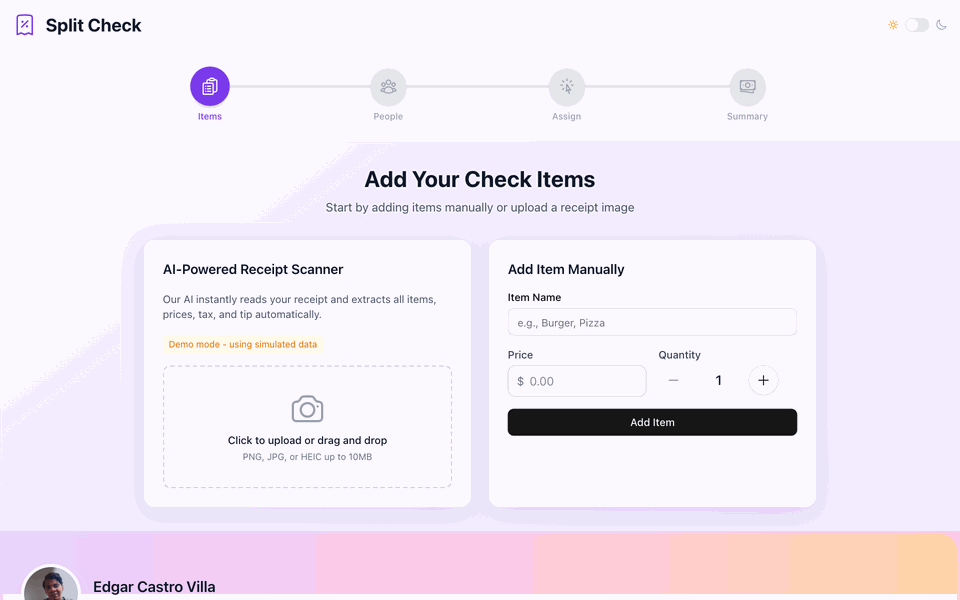

# Split Check

A web app for splitting restaurant checks among multiple people. Add items, assign people, distribute costs, and view payment summaries — all in a simple 4-step workflow.

**[Live Demo](https://split-check-41cb9.web.app/)**



## Features

- **Receipt OCR** — Upload a photo of your receipt to auto-extract items (powered by AWS Textract)
- **Drag & Drop** — Assign items to people with an intuitive drag-and-drop interface
- **Shared Items** — Split individual items across multiple people
- **Smart Calculations** — Proportional tax, tip, and service charge distribution
- **PDF Export** — Generate and share payment summaries
- **Dark Mode** — Full light/dark theme support
- **i18n** — English and Spanish translations
- **Responsive** — Mobile-first design

## Tech Stack

| Category | Technology |
|---|---|
| Framework | React 19 |
| Language | TypeScript 5.9 |
| Build Tool | Rolldown-Vite |
| Styling | Tailwind CSS v4 |
| UI Components | shadcn/ui + Radix UI |
| Icons | Heroicons |
| Animations | Motion (React) |
| Drag & Drop | @dnd-kit |
| i18n | react-i18next |
| Backend | Firebase Functions (Python) |
| OCR | AWS Textract |
| Hosting | Firebase Hosting |
| Runtime | Bun |

## Getting Started

### Prerequisites

- [Bun](https://bun.sh/) (v1.0+)
- [Node.js](https://nodejs.org/) (v18+)
- [Python 3.13](https://www.python.org/) (for Firebase Functions)

### Installation

```bash
# Clone the repository
git clone https://github.com/your-username/split-check.git
cd split-check

# Install dependencies
bun install
```

### Environment Variables

Create a `.env` file in the root directory:

```env
VITE_FIREBASE_API_KEY=your_firebase_api_key
VITE_FIREBASE_APP_ID=your_firebase_app_id
VITE_FIREBASE_MESSAGING_SENDER_ID=your_sender_id
VITE_RECAPTCHA_SITE_KEY=your_recaptcha_site_key
VITE_APPCHECK_DEBUG_TOKEN=your_debug_token
```

### Run the App

```bash
# Start development server (demo mode, no backend needed)
bun dev

# Start with Firebase Functions emulator
bun start
```

Open [http://localhost:5173](http://localhost:5173) in your browser.

## Scripts

| Command | Description |
|---|---|
| `bun dev` | Start dev server in demo mode |
| `bun start` | Start dev server + Firebase Functions emulator |
| `bun run build` | TypeScript check + production build |
| `bun preview` | Preview production build locally |
| `bun lint` | Run ESLint + Prettier checks |
| `bun run format` | Auto-format code with Prettier |

## Firebase Functions Setup

```bash
cd functions
python -m venv venv
source venv/bin/activate
pip install -r requirements.txt

# Run locally
firebase emulators:start --only functions

# Deploy
firebase deploy --only functions
```

## License

MIT
